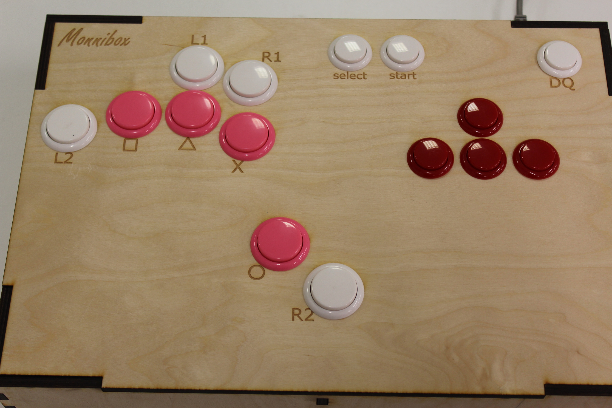

# Monnibox game controller

Monnibox is my custom solution to having trouble making precise inputs with a game pad when playing Tekken 7. The basic concept is using only buttons instead of the more common arcade stick controllers. The precision comes largely from being able to use separate fingers to input each cardinal direction. I also laid out the primary action buttons in a way that i can use my thumb to press one of them and three other fingers for the rest.

My Monnibox was created in the University of Oulu Fab Lab using laser cutter.

## Contents of this repository

This repository contains the SVG files for the case of Monnibox. Each panel is in a separate file. Left and right panels are currently identical but have been included separately to support possible future modifications. The width of the cutting line was 0.02 mm for the laser cutter I was using. The box was generated using a tabbed box script, and the top panel was modified so that it comes off with a little bit of force but stays in place while using the controller. 

The panels have been designed for 6 mm plywood. If using material of different thickness, tab height needs to be adjusted accordingly. The box was designed to house Brook Universal Fighting Board - measurements for the USB connector hole in the back panel and mounting holes in the bottom panel are based on the PCB. The top panel has 8 30mm diameter and 7 24mm diameter holes for buttons. I used 30mm and 24mm Sanwa buttons. 

You can change the layout to your liking easily by just moving the holes. Just pay attention to the middle support panel. As you can see, there is a hole in the current middle support because on of the buttons needs to fit there. There's also a smaller hole for cables. 

## Assembly

Printing your own box with a laser cutter is rather quick, and the assembly is very simple: fit the walls and the middle support together, and then put the bottom in place. The box stays together even without glue, but applying some is recommended. While assembling my box I only put glue in the left and right panels - the rest of the box stays together just fine. 
